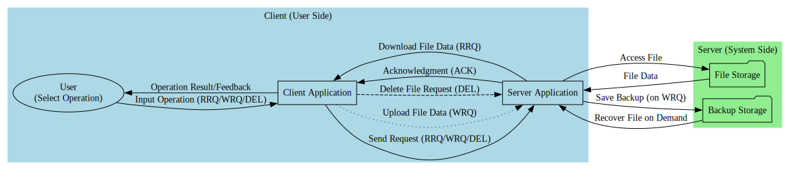

# UDP File Transfer System
Haim Ozer - 316063569 
--------------------------
Nov 2024 | RTED collage

This project implements a UDP-based file transfer system similar to TFTP (Trivial File Transfer Protocol) with enhanced features such as packet acknowledgment, encryption, and file recovery.

## Workflow Diagram

## Key Differences: UDP vs. FTP

| **Feature**               | **UDP**                                                        | **FTP**                                                      |
|---------------------------|----------------------------------------------------------------|-------------------------------------------------------------|
| **Protocol Type**         | Connectionless                                                | Connection-oriented                                         |
| **Reliability**           | Unreliable, no inherent acknowledgment or retransmission      | Reliable, ensures data delivery through acknowledgments     |
| **Speed**                 | Faster due to minimal overhead                                | Slower due to connection setup and control overhead         |
| **Use Cases**             | Real-time applications, streaming, gaming                    | File transfers, data storage, and retrieval                 |
| **Security**              | Minimal built-in security; relies on additional encryption    | More secure with built-in authentication and encryption     |

## Features of the Project
- **File Upload, Download, and Deletion**.
- **Encryption for Secure Transfers**.
- **Packet Acknowledgment and Reliability Enhancements**.
- **Backup and File Recovery**.

## How to Run
1. Compile the project using your preferred C++ compiler.
2. Start the server:
   ./server
