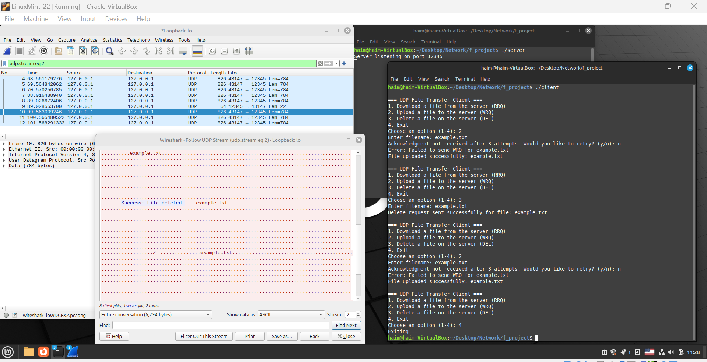

# UDP File Transfer System  
**Author:** Haim Ozer  
**ID:** 316063569  
**Date:** November 2024  
**Institution:** RTED College  

---

## Overview  
This project implements a lightweight UDP-based file transfer system inspired by TFTP (Trivial File Transfer Protocol). It provides enhanced functionality for file uploads, downloads, and deletions, along with features like packet acknowledgment, encryption, and file recovery. The system is designed for real-time applications where speed and efficiency are critical.

---

## Workflow Diagram  

The diagram above illustrates the workflow of the system, highlighting interactions between the user, client, server, and file storage.

---

## Testing Print-screen  

The screenshot demonstrates the UDP-based file transfer system in action. Key observations:

1. **Server and Client Communication:**

* The server is listening on port 12345 and successfully processes client requests.
* The client interacts with the server to perform file operations, such as uploading (WRQ), downloading (RRQ), and deleting (DEL).

2. **Wireshark Capture:**

* Wireshark is used to monitor UDP traffic between the client and server.
* The UDP stream highlights the data being transferred, including the success messages for file operations like File uploaded successfully and File deleted.

3. **System Behavior:**

* The client retries file operations when acknowledgments are not received, demonstrating the reliability mechanisms in the code.
* Successful requests are confirmed in both the client terminal and server logs. 

---

## Key Features  

1. **File Upload (WRQ)**:  
   Users can upload files to the server with data sent in packets, each acknowledged by the server for reliable delivery.  

2. **File Download (RRQ)**:  
   Users can request files from the server, which are transmitted in chunks to ensure data integrity.  

3. **File Deletion (DEL)**:  
   Users can delete files stored on the server.  

4. **Encryption**:  
   All file data is encrypted during transmission to enhance security.  

5. **Packet Acknowledgment**:  
   Custom acknowledgment mechanisms improve reliability over the standard UDP protocol.  

6. **Backup and Recovery**:  
   Uploaded files are backed up on the server for recovery in case of accidental deletion or data corruption.

---

## Key Differences: UDP vs. FTP  

| **Feature**               | **UDP**                                                        | **FTP**                                                      |
|---------------------------|----------------------------------------------------------------|-------------------------------------------------------------|
| **Protocol Type**         | Connectionless                                                | Connection-oriented                                         |
| **Reliability**           | Unreliable, no inherent acknowledgment or retransmission      | Reliable, ensures data delivery through acknowledgments     |
| **Speed**                 | Faster due to minimal overhead                                | Slower due to connection setup and control overhead         |
| **Use Cases**             | Real-time applications, streaming, gaming                    | File transfers, data storage, and retrieval                 |
| **Security**              | Minimal built-in security; relies on additional encryption    | More secure with built-in authentication and encryption     |

---

## System Components  

### Client
- **User Interface**: Users select operations (upload, download, or delete) and provide file names.  
- **Packet Transmission**: Handles data packaging, encryption, and sending requests to the server.  
- **Acknowledgment Handling**: Receives and processes responses from the server.  

### Server
- **Request Processing**: Handles incoming file operations and validates client requests.  
- **File Storage**: Stores uploaded files and retrieves requested files.  
- **Backup System**: Creates backups for recovery and ensures data availability.  

---

## Security Features  
1. **Data Encryption**: All file data is encrypted to prevent unauthorized access during transmission.  
2. **Checksum Verification**: Each packet includes a checksum for integrity checks, ensuring no data corruption occurs.  

---

## How to Run the Project  
### 1. Compile the Code 
* g++ server.cpp udp_file_transfer.cpp -o server
* g++ client.cpp udp_file_transfer.cpp -o client

### 2. Run 
* ./server
* ./client
